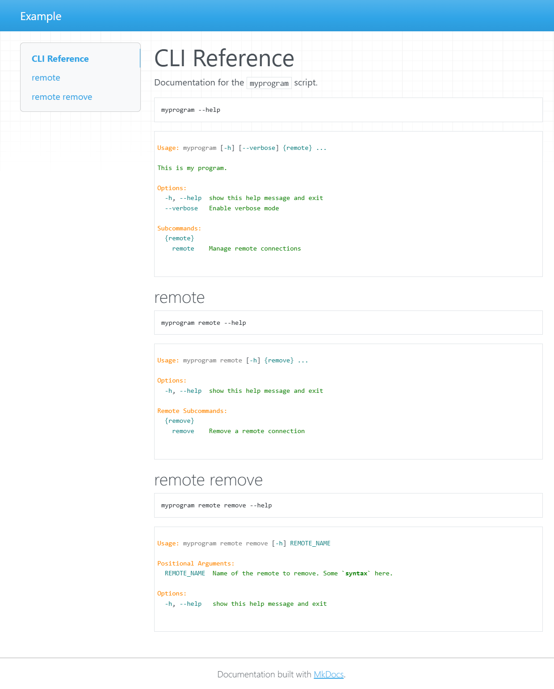

To generate CLI documentation from a argparse parser from [parser.py](parser.py) run:

```bash
pip install -e ..
mkdocs serve
```

And visit [http://127.0.0.1:8000/cli/](http://127.0.0.1:8000/cli/).

It should look something like this:
[](screenshot.png)
